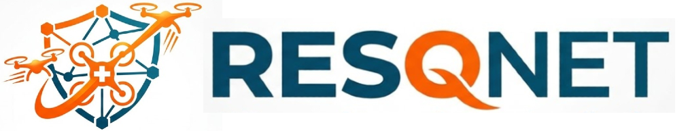

<p align="center">
  
</p>

<h3 align="center">AI-Powered Search & Rescue Drone Swarm Coordination Platform</h3>

<p align="center">
  <em>Real-time disaster monitoring • Autonomous drone scouting • Intelligent rescue strategy generation</em>
</p>

---

## What is ResQNet?

**ResQNet** is an end-to-end platform that combines **AI reasoning**, **drone swarm coordination**, and a **real-time operator dashboard** to accelerate search-and-rescue operations during natural disasters.

The system monitors social media for emerging disasters, deploys autonomous drone swarms to survey affected areas, and generates actionable rescue strategies — all in real time.

---

## Platform Architecture

<p align="center">
  
</p>

---

## Modules

| Module | Description | Status |
|---|---|---|
| [**Reasoning Agent**](Resoning%20Agent/) | AI core — LLM/VLM reasoning, YOLO detection, heatmap generation, rescue strategy planning | 🚧 In Progress |
| [**Drone Controller**](Drone%20Controller/) | Drone swarm coordination, flight path management, live feed streaming | 🚧 In Progress |
| [**WebApp**](Webapp/) | Real-time operator dashboard with maps, heatmaps, drone feeds, and rescue plans | 🚧 In Progress |

---

## Operational Phases

### Phase 0 — Monitor *(Always Running)*
- Scrape X (Twitter) trending topics for potential disasters
- LLM-based validation and classification of disaster signals
- Hourly automated sweeps with manual trigger option

### Phase 1 — Scout *(Stage 1)*
- Dispatch drone swarm to selected geo-zone
- Analyze high-altitude drone feed with VLM + YOLO
- Generate danger heatmap, people density map, and rescue priority map
- Produce rescue strategy and escape route overlays

### Phase 2a — Search *(Stage 2)*
- Send refined close-range flight instructions to drones
- Continuously update all maps with higher-resolution detections

### Phase 2b — Rescue *(Stage 2)*
- Generate safety instructions for field broadcast
- Produce structured rescue plans for first-responder officers

---

## Tech Stack

| Layer | Technologies |
|---|---|
| **AI Models** | OpenRouter (LLM + VLM), Ultralytics YOLO (local detection) |
| **Backend** | Python 3.11+, FastAPI, Uvicorn |
| **Mapping** | OpenCV, NumPy, GeoPandas, Folium |
| **Social Intel** | Tweepy / Ntscraper / RapidAPI |
| **Infrastructure** | Pydantic v2, Loguru, APScheduler |

---

## Getting Started

```bash
# Clone the repo
git clone https://github.com/MokhtarOuardi/ResQNet.git
cd ResQNet

# See individual module READMEs for setup instructions
```

Each module has its own README with detailed setup and configuration instructions.

---

## Team

Built for **Hackathon 2025**.

---

