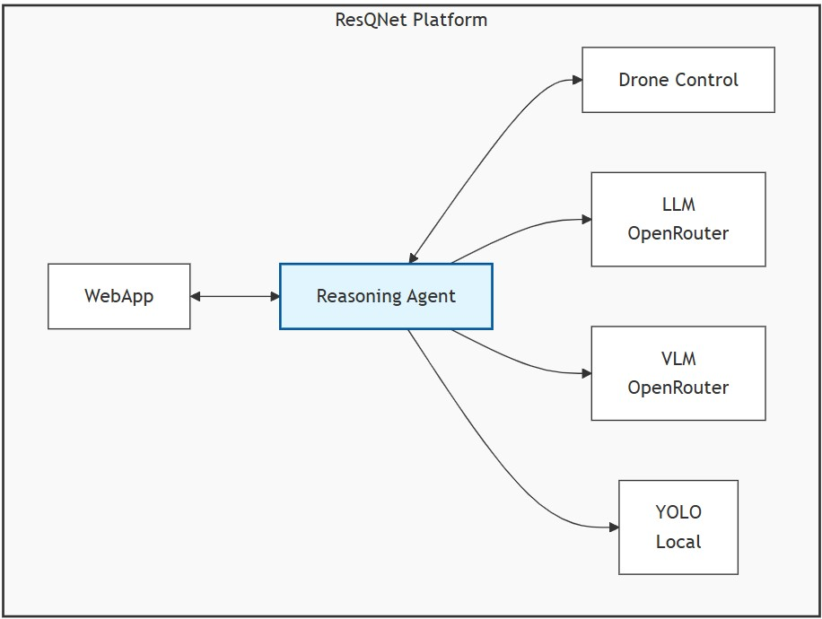
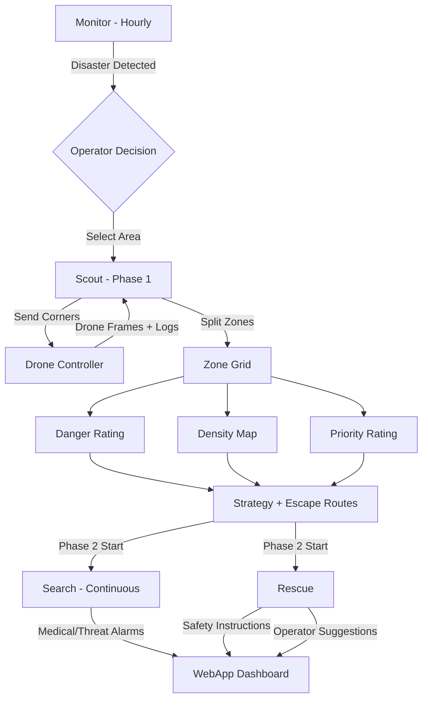

<p align="center">
  
</p>

# Reasoning Agent

> **AI-powered reasoning engine for autonomous search-and-rescue drone swarm coordination.**

The Reasoning Agent is the cognitive core of the ResQNet platform. It ingests real-time social-media signals and drone imagery, builds situational-awareness maps, and produces actionable rescue strategies -- all orchestrated through a multi-phase pipeline backed by LLMs and VLMs via OpenRouter.

---

## Table of Contents

- [Architecture Overview](#architecture-overview)
- [Phase Pipeline](#phase-pipeline)
- [API Reference](#api-reference)
- [Project Structure](#project-structure)
- [Getting Started](#getting-started)
- [Configuration](#configuration)
- [Developers](#developers)

---

## Architecture Overview

<p align="center">
  
</p>

The Reasoning Agent runs as **5 FastAPI services** (4 modules + 1 unified agent):

| Service | Port | Role |
|---|---|---|
| **Monitor** (`monitor.py`) | 8000 | Social media intelligence |
| **Scout** (`scout.py`) | 8001 | Drone frame analysis and zone mapping |
| **Search** (`search.py`) | 8002 | Continuous detection and emergency alerts |
| **Rescue** (`rescue.py`) | 8003 | Safety instructions and operator guidance |
| **Agent** (`ResQnet_agent.py`) | 8080 | Unified LLM agent with tool-calling |

The services communicate with:
- **WebApp** via REST APIs
- **Drone Controller** (Unity, port 5000) for flight commands and receiving feeds
- **OpenRouter** for LLM and VLM inference

---

## Phase Pipeline

### Phase 0 -- Monitor

> Always running. Scrapes X/Twitter for disaster signals.

| Function | Endpoint | Description |
|---|---|---|
| Scan Trends | `POST /api/monitor/scan_trends` | Scrape trending topics, LLM classifies for disaster relevance |
| Analyze Hashtag | `POST /api/monitor/analyze_tag` | Deep-dive a hashtag for rescue-relevant incident details |
| Update Context | `POST /api/monitor/update_context` | Append reasoning to persistent context for continuity |

Uses **twikit** for X/Twitter scraping (no API key required) and LLM for classification.

---

### Phase 1 -- Scout

> Activated when an operator selects a search-and-rescue area.

| Function | Endpoint | Description |
|---|---|---|
| Detect Frame | `POST /api/scout/detect` | VLM analyzes a drone frame for buildings, people, fire, smoke, flood |
| Split Zones | `POST /api/scout/split_zones` | Parse drone logs, split GPS area into NxN grid, map frames to zones |
| Danger Rating | `POST /api/scout/danger_rating` | VLM samples zone frames, rates danger 0.0 to 1.0 |
| People Density | `POST /api/scout/density` | VLM estimates population density per zone |
| Rescue Priority | `POST /api/scout/priority` | VLM + context assigns priority 1 (highest) to 10 (lowest) |
| Rescue Strategy | `POST /api/scout/strategy` | LLM generates phased rescue plan with resource allocation |
| Escape Routes | `POST /api/scout/escape_routes` | LLM identifies safety zones and generates evacuation routes |

Reads drone frame JPGs and per-drone log files (`FrameNum|Timestamp|GPS_X|GPS_Y|Altitude|Battery`).

---

### Phase 2a -- Search

> Active during stage 2. Continuous monitoring of drone feeds.

| Function | Endpoint | Description |
|---|---|---|
| Continuous Update | `POST /api/search/update` | Batch-process new drone frames, track changes and urgency |
| Medical Detection | `POST /api/search/medical` | VLM detects medical emergencies, auto-triggers alarm if critical |
| Threat Detection | `POST /api/search/threats` | VLM detects structural, fire, flood, and other threats |

Includes an **alarm queue** (`GET /api/search/alarms`) that the WebApp polls for operator notifications.

---

### Phase 2b -- Rescue

> Active during stage 2. Runs concurrently with Search.

| Function | Endpoint | Description |
|---|---|---|
| Safety Instructions | `POST /api/rescue/safety_instructions` | VLM describes scene, LLM generates person-specific safety instructions |
| Operator Suggestions | `POST /api/rescue/operator_suggestions` | VLM tactical assessment, LLM generates operator action plan and resource requests |

Both use a **VLM-to-LLM pipeline**: VLM first analyzes the drone frame to describe the scene, then LLM generates actionable output based on that description.

---

### Unified Agent

> Single conversational interface for the entire platform.

| Endpoint | Description |
|---|---|
| `POST /api/agent/chat` | Send a message, the LLM autonomously selects and chains tools |
| `GET /api/agent/tools` | List all 21 available tools |
| `GET /api/agent/history` | View conversation history |

The agent wraps all module endpoints as **LLM tools** and uses OpenRouter's function-calling to orchestrate them. It can chain up to 10 tool calls per turn.

**Tool inventory (21 total):**

| Module | Tools |
|---|---|
| Monitor (4) | `scan_trends`, `analyze_tag`, `update_context`, `get_alerts` |
| Scout (7) | `detect`, `split_zones`, `danger_rating`, `density`, `priority`, `strategy`, `escape_routes` |
| Search (4) | `update`, `medical`, `threats`, `get_alarms` |
| Rescue (2) | `safety_instructions`, `operator_suggestions` |
| Drone (4) | `send_phase1`, `send_phase2`, `get_data`, `get_frame` |

---

## API Reference

### Monitor (port 8000)

| Method | Endpoint | Description |
|---|---|---|
| `POST` | `/api/monitor/scan_trends` | Scan X trending topics for disaster signals |
| `POST` | `/api/monitor/analyze_tag` | Analyze a specific hashtag |
| `POST` | `/api/monitor/update_context` | Append reasoning to context |
| `GET` | `/api/monitor/status` | Latest monitoring status |
| `GET` | `/api/monitor/alerts` | Cached scan alerts |
| `GET` | `/api/monitor/context` | Current reasoning context |
| `DELETE` | `/api/monitor/context` | Clear reasoning context |

### Scout (port 8001)

| Method | Endpoint | Description |
|---|---|---|
| `POST` | `/api/scout/detect` | Analyze a drone frame (VLM detection) |
| `POST` | `/api/scout/split_zones` | Split area into NxN grid |
| `POST` | `/api/scout/danger_rating` | Danger rating for a zone |
| `POST` | `/api/scout/density` | People density for a zone |
| `POST` | `/api/scout/priority` | Rescue priority for a zone |
| `POST` | `/api/scout/strategy` | Generate rescue strategy |
| `POST` | `/api/scout/escape_routes` | Generate escape routes |
| `GET` | `/api/scout/zones` | All zone data |
| `GET` | `/api/scout/context` | Scout reasoning context |

### Search (port 8002)

| Method | Endpoint | Description |
|---|---|---|
| `POST` | `/api/search/update` | Process new drone frames |
| `POST` | `/api/search/medical` | Detect medical emergencies |
| `POST` | `/api/search/threats` | Detect threats |
| `GET` | `/api/search/alarms` | Active alarm queue |
| `GET` | `/api/search/status` | Search module status |
| `DELETE` | `/api/search/alarms` | Clear alarms |

### Rescue (port 8003)

| Method | Endpoint | Description |
|---|---|---|
| `POST` | `/api/rescue/safety_instructions` | Generate person safety instructions |
| `POST` | `/api/rescue/operator_suggestions` | Generate operator action suggestions |
| `GET` | `/api/rescue/context` | Rescue reasoning context |

### Agent (port 8080)

| Method | Endpoint | Description |
|---|---|---|
| `POST` | `/api/agent/chat` | Chat with the unified agent |
| `GET` | `/api/agent/tools` | List available tools |
| `GET` | `/api/agent/history` | Conversation history |
| `DELETE` | `/api/agent/history` | Clear history |

---

## Project Structure

```
Resoning Agent/
  README.md
  requirements.txt
  .env.example
  .env                          # Your local config (git-ignored)
  monitor.py                    # Phase 0 -- social media monitoring
  scout.py                      # Phase 1 -- drone frame analysis, zone mapping
  search.py                     # Phase 2a -- continuous detection, alarms
  rescue.py                     # Phase 2b -- safety instructions, operator guidance
  ResQnet_agent.py              # Unified LLM agent with 21 tools
  test.py                       # Quick test for monitor/scan_trends
  test_flow_simulation.py       # End-to-end test: Scout -> Search -> Rescue
```

---

## Getting Started

### Prerequisites

- Python 3.11+
- OpenRouter API key -- [openrouter.ai](https://openrouter.ai/)
- X/Twitter credentials (for Monitor module only)

### Installation

```bash
cd "ResQNet/Resoning Agent"

# Create virtual environment
python -m venv venv
venv\Scripts\activate            # Windows
# source venv/bin/activate       # Linux/Mac

# Install dependencies
pip install -r requirements.txt
```

### Run

```bash
# Start individual modules
python monitor.py               # port 8000
python scout.py                 # port 8001
python search.py                # port 8002
python rescue.py                # port 8003

# Start the unified agent (requires modules above to be running)
python ResQnet_agent.py         # port 8080

# Run the full flow test (requires scout, search, rescue to be running)
python test_flow_simulation.py
```

---

## Configuration

Copy `.env.example` to `.env` and fill in your values:

```env
# Twitter / X credentials (for twikit -- Monitor module)
TWITTER_USERNAME=your_x_username
TWITTER_EMAIL=your_email@example.com
TWITTER_PASSWORD=your_password

# OpenRouter API
OPENROUTER_API_KEY=sk-or-...
OPENROUTER_VLM_MODEL=google/gemma-3-4b-it:free
OPENROUTER_LLM_MODEL=stepfun/step-3.5-flash:free

# Drone Controller
DRONE_CONTROLLER_URL=http://127.0.0.1:5000

# Dataset path (defaults to ../Dataset)
DATASET_PATH=../Dataset
```

---

## Pipeline Flow



---

## Developers

| Name | Role |
|---|---|
| Mokhtar Ouardi | Lead Developer |

Built for **Hackathon 2025**.

---
