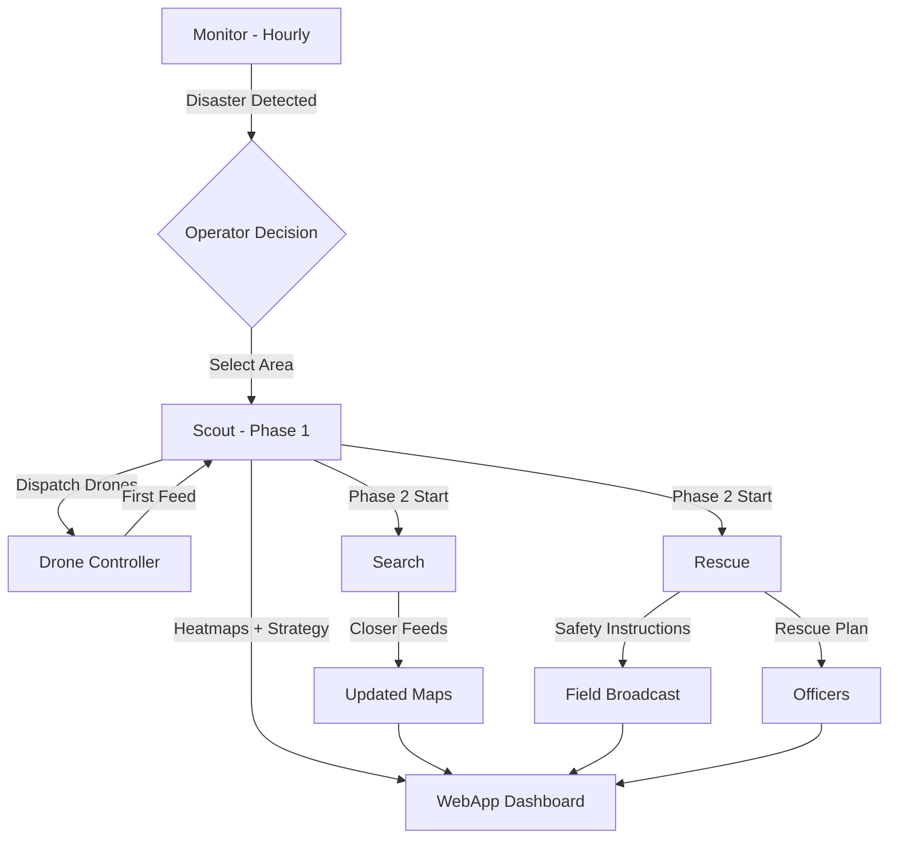

<![CDATA[# 🚁 ResQNet — Reasoning Agent

> **AI-powered reasoning engine for autonomous search-and-rescue drone swarm coordination.**

The Reasoning Agent is the cognitive core of the ResQNet platform. It ingests real-time social-media signals and drone imagery, builds situational-awareness maps, and produces actionable rescue strategies — all orchestrated through a multi-phase pipeline backed by **LLMs**, **VLMs**, and **object-detection models**.

---

## Table of Contents

- [Architecture Overview](#architecture-overview)
- [Phase Pipeline](#phase-pipeline)
  - [Phase 0 — Monitor](#phase-0--monitor)
  - [Phase 1 — Scout](#phase-1--scout)
  - [Phase 2a — Search](#phase-2a--search)
  - [Phase 2b — Rescue](#phase-2b--rescue)
- [Tech Stack](#tech-stack)
- [Project Structure](#project-structure)
- [Models & Providers](#models--providers)
- [API Reference](#api-reference)
- [Getting Started](#getting-started)
- [Configuration](#configuration)
- [License](#license)

---

## Architecture Overview

```
┌──────────────────────────────────────────────────────────┐
│                     ResQNet Platform                     │
│  ┌─────────┐   ┌──────────────────┐   ┌──────────────┐  │
│  │  WebApp  │◄─►│ Reasoning Agent  │◄─►│Drone Control │  │
│  └─────────┘   └──────────────────┘   └──────────────┘  │
│                        │                                 │
│            ┌───────────┼───────────┐                     │
│            ▼           ▼           ▼                     │
│       ┌────────┐  ┌────────┐  ┌────────┐                │
│       │  LLM   │  │  VLM   │  │  YOLO  │                │
│       │OpenRtr │  │OpenRtr │  │ Local  │                │
│       └────────┘  └────────┘  └────────┘                │
└──────────────────────────────────────────────────────────┘
```

The Reasoning Agent exposes a **FastAPI** service that:

1. Communicates with the **WebApp** via REST/WebSocket APIs.
2. Sends geolocation instructions and receives feeds from the **Drone Controller**.
3. Delegates inference to three model tiers — LLM, VLM, and YOLO.

---

## Phase Pipeline

### Phase 0 — Monitor

> *Always running — triggered once per hour (configurable via cron).*

| Capability | Description |
|---|---|
| **Trend Scraping** | Scrape trending topics on X (Twitter) to detect potential disasters in real time. |
| **Hashtag Intelligence** | Once a candidate event is identified, scrape relevant hashtags for incident details (location, severity, type). |
| **Validation** | LLM-based classification to filter noise and confirm genuine disaster signals. |
| **WebApp API** | REST endpoint for the WebApp to query the latest monitoring results and alerts. |

**Key components:** `monitor/scraper.py`, `monitor/classifier.py`, `monitor/scheduler.py`

---

### Phase 1 — Scout

> *Activated when an operator selects a search-and-rescue area.*

| Capability | Description |
|---|---|
| **Geo-dispatch** | Send selected geolocation bounds to the Drone Controller API. |
| **Initial Feed Analysis** | VLM + YOLO process the first high-altitude drone feed to produce a scene report. |
| **Building Detection** | YOLO-based detection of structures in the geo-zone. |
| **Population Estimation** | VLM-driven crowd/density estimation. |
| **Disaster Classification** | Detect flood, fire, structural collapse, etc. |
| **Danger Heatmap** | Spatial heatmap of hazard intensity across the zone. |
| **People Density Map** | Estimated population distribution overlay. |
| **Rescue Priority Map** | Combined risk × density heatmap to rank rescue urgency. |
| **Strategy Generation** | LLM synthesizes all maps into a rescue strategy document. |
| **Escape Route Overlay** | LLM + pathfinding generates safe evacuation routes and safety-zone markers. |

**Key components:** `scout/dispatcher.py`, `scout/scene_analyzer.py`, `scout/heatmap_engine.py`, `scout/strategy_generator.py`

---

### Phase 2a — Search

> *Active during stage 2 — closer-range reconnaissance.*

| Capability | Description |
|---|---|
| **Refined Instructions** | Send updated drone waypoints/altitude to the Drone Controller for closer-range sweeps. |
| **Continuous Feed Analysis** | Process new, higher-resolution frames with VLM + YOLO. |
| **Map Updates** | Incrementally update danger, density, and priority heatmaps with new detections. |

**Key components:** `search/flight_planner.py`, `search/feed_processor.py`, `search/map_updater.py`

---

### Phase 2b — Rescue

> *Active during stage 2 — runs concurrently with Search.*

| Capability | Description |
|---|---|
| **Field Safety Instructions** | LLM generates clear, actionable safety guidance for people on the ground (broadcast-ready). |
| **Rescue Plan** | LLM produces a structured rescue plan for first-responder officers, including priorities, routes, and resource allocation. |

**Key components:** `rescue/instruction_generator.py`, `rescue/plan_generator.py`

---

## Tech Stack

### Core Runtime

| Layer | Technology | Purpose |
|---|---|---|
| **Language** | Python 3.11+ | Primary language |
| **API Framework** | FastAPI + Uvicorn | Async REST & WebSocket server |
| **Task Scheduling** | APScheduler | Cron-based monitor phase scheduling |
| **Async HTTP** | httpx / aiohttp | Non-blocking external API calls |

### AI / ML Models

| Model Tier | Provider | Models (recommended) | Role |
|---|---|---|---|
| **LLM** | OpenRouter | `anthropic/claude-sonnet-4` / `google/gemini-2.5-pro` | Reasoning, planning, strategy generation, safety instructions |
| **VLM** | OpenRouter | `google/gemini-2.5-pro` / `anthropic/claude-sonnet-4` | Drone-frame description, population estimation, disaster classification |
| **Object Detection** | Local (Ultralytics) | YOLOv8 / YOLOv11 (custom-trained) | Building detection, person detection, vehicle detection, fire/flood segmentation |

### Data & Mapping

| Component | Technology | Purpose |
|---|---|---|
| **Geospatial** | GeoPandas + Shapely | Zone geometry, coordinate transforms |
| **Heatmaps** | NumPy + OpenCV | Danger / density / priority map generation |
| **Map Rendering** | Folium / Leaflet (via API) | Interactive map overlays for the WebApp |
| **Image Processing** | Pillow + OpenCV | Frame pre-processing, annotation, overlay compositing |

### Social Media Intelligence

| Component | Technology | Purpose |
|---|---|---|
| **X (Twitter) Scraping** | Tweepy / Ntscraper / RapidAPI | Trend monitoring & hashtag scraping |
| **NLP Filtering** | LLM-based (OpenRouter) | Disaster-relevance classification |

### Infrastructure

| Component | Technology | Purpose |
|---|---|---|
| **Config** | Pydantic Settings + `.env` | Environment-based configuration |
| **Logging** | Loguru | Structured async-safe logging |
| **Validation** | Pydantic v2 | Request/response schema validation |
| **Testing** | pytest + pytest-asyncio | Unit & integration tests |

---

## Project Structure

```
Resoning Agent/
├── README.md
├── requirements.txt
├── .env.example
├── config/
│   └── settings.py              # Pydantic settings & env loading
├── main.py                      # FastAPI app entry point
├── api/
│   ├── routes/
│   │   ├── monitor.py           # Monitor phase endpoints
│   │   ├── scout.py             # Scout phase endpoints
│   │   ├── search.py            # Search phase endpoints
│   │   └── rescue.py            # Rescue phase endpoints
│   └── schemas/
│       ├── monitor.py           # Request/response models
│       ├── scout.py
│       ├── search.py
│       └── rescue.py
├── core/
│   ├── llm_client.py            # OpenRouter LLM wrapper
│   ├── vlm_client.py            # OpenRouter VLM wrapper
│   ├── yolo_detector.py         # Ultralytics YOLO inference
│   └── prompts/
│       ├── monitor_prompts.py   # Prompt templates for monitor phase
│       ├── scout_prompts.py
│       ├── search_prompts.py
│       └── rescue_prompts.py
├── monitor/
│   ├── scraper.py               # Twitter/X trend & hashtag scraping
│   ├── classifier.py            # Disaster-event validation (LLM)
│   └── scheduler.py             # APScheduler cron job
├── scout/
│   ├── dispatcher.py            # Send geo-bounds to Drone Controller
│   ├── scene_analyzer.py        # VLM + YOLO first-frame analysis
│   ├── heatmap_engine.py        # Danger / density / priority maps
│   └── strategy_generator.py    # Rescue strategy & escape routes
├── search/
│   ├── flight_planner.py        # Updated waypoints for closer sweeps
│   ├── feed_processor.py        # Continuous VLM + YOLO processing
│   └── map_updater.py           # Incremental heatmap updates
├── rescue/
│   ├── instruction_generator.py # Safety instructions for the field
│   └── plan_generator.py        # Rescue plan for officers
├── utils/
│   ├── geo.py                   # Geospatial helpers
│   ├── image.py                 # Frame pre-processing utilities
│   └── overlay.py               # Map overlay compositing
├── models/
│   └── yolo/                    # Custom YOLO weights & configs
└── tests/
    ├── test_monitor.py
    ├── test_scout.py
    ├── test_search.py
    └── test_rescue.py
```

---

## Models & Providers

### OpenRouter Integration

All LLM and VLM calls are routed through the [OpenRouter](https://openrouter.ai/) unified API.

```python
# Example: core/llm_client.py
import httpx

OPENROUTER_BASE = "https://openrouter.ai/api/v1"

async def chat_completion(messages: list, model: str, **kwargs) -> str:
    async with httpx.AsyncClient() as client:
        resp = await client.post(
            f"{OPENROUTER_BASE}/chat/completions",
            headers={"Authorization": f"Bearer {OPENROUTER_API_KEY}"},
            json={"model": model, "messages": messages, **kwargs},
        )
        return resp.json()["choices"][0]["message"]["content"]
```

### YOLO Detection

Object detection runs **locally** via [Ultralytics](https://docs.ultralytics.com/).

```python
# Example: core/yolo_detector.py
from ultralytics import YOLO

class Detector:
    def __init__(self, weights: str = "models/yolo/resqnet.pt"):
        self.model = YOLO(weights)

    def detect(self, frame, conf: float = 0.25):
        results = self.model.predict(frame, conf=conf)
        return results[0].boxes.data.cpu().numpy()
```

Custom weights can be fine-tuned on disaster-specific datasets (collapsed buildings, flooded areas, fire, stranded persons).

---

## API Reference

### Monitor

| Method | Endpoint | Description |
|---|---|---|
| `GET` | `/api/monitor/status` | Latest monitoring status & detected events |
| `GET` | `/api/monitor/alerts` | Active disaster alerts with confidence scores |
| `POST` | `/api/monitor/trigger` | Manually trigger a monitoring sweep |

### Scout

| Method | Endpoint | Description |
|---|---|---|
| `POST` | `/api/scout/dispatch` | Send geo-zone to Drone Controller & start scouting |
| `GET` | `/api/scout/heatmaps` | Retrieve generated heatmaps (danger, density, priority) |
| `GET` | `/api/scout/strategy` | Get generated rescue strategy |
| `GET` | `/api/scout/overlay` | Get escape route / safety zone overlay |

### Search

| Method | Endpoint | Description |
|---|---|---|
| `POST` | `/api/search/start` | Send refined instructions & begin search phase |
| `GET` | `/api/search/maps` | Get latest updated heatmaps |
| `WS` | `/ws/search/feed` | Real-time feed processing updates |

### Rescue

| Method | Endpoint | Description |
|---|---|---|
| `GET` | `/api/rescue/instructions` | Safety instructions for field broadcast |
| `GET` | `/api/rescue/plan` | Structured rescue plan for officers |

---

## Getting Started

### Prerequisites

- **Python 3.11+**
- **OpenRouter API key** → [openrouter.ai](https://openrouter.ai/)
- **YOLO weights** — pretrained or custom (place in `models/yolo/`)

### Installation

```bash
# Clone the repo (if standalone)
cd "ResQNet/Resoning Agent"

# Create virtual environment
python -m venv venv
source venv/bin/activate   # Linux/Mac
venv\Scripts\activate      # Windows

# Install dependencies
pip install -r requirements.txt
```

### Environment Variables

Copy `.env.example` to `.env` and fill in:

```env
OPENROUTER_API_KEY=sk-or-...
OPENROUTER_LLM_MODEL=anthropic/claude-sonnet-4
OPENROUTER_VLM_MODEL=google/gemini-2.5-pro
YOLO_WEIGHTS_PATH=models/yolo/resqnet.pt
DRONE_CONTROLLER_URL=http://localhost:8001
MONITOR_INTERVAL_MINUTES=60
TWITTER_BEARER_TOKEN=...
```

### Run

```bash
uvicorn main:app --host 0.0.0.0 --port 8000 --reload
```

---

## Configuration

All configuration is managed via **Pydantic Settings** with `.env` file support:

```python
# config/settings.py
from pydantic_settings import BaseSettings

class Settings(BaseSettings):
    openrouter_api_key: str
    openrouter_llm_model: str = "anthropic/claude-sonnet-4"
    openrouter_vlm_model: str = "google/gemini-2.5-pro"
    yolo_weights_path: str = "models/yolo/resqnet.pt"
    drone_controller_url: str = "http://localhost:8001"
    monitor_interval_minutes: int = 60
    twitter_bearer_token: str = ""

    class Config:
        env_file = ".env"
```

---

## Pipeline Flow



---

## License

Part of the **ResQNet** platform — Hackathon 2025.
]]>
