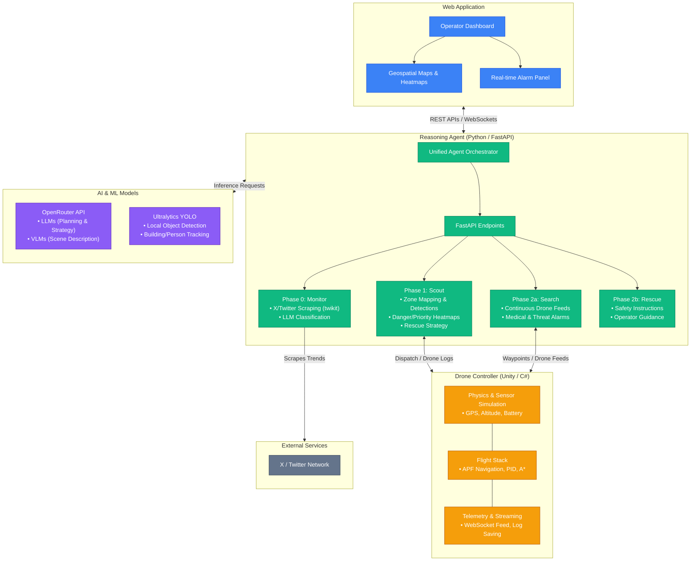

# ResQNet — Tech Stack Overview

This document outlines the end-to-end technology stack and module architecture for the **ResQNet** platform.

## Architecture Diagram

## Technology Stack Breakdown

### 1. Reasoning Agent
* **Language**: Python 3.11+
* **Framework**: FastAPI (Async REST routes), Uvicorn
* **HTTP/Async**: `httpx`, `asyncio`
* **Social Scraping**: `twikit` (Allows unauthenticated Twitter trend and hashtag scraping)
* **Infrastructure**: `pydantic` v2, `loguru` for structured logging, `python-dotenv`

### 2. AI & Machine Learning
* **LLM / VLM API**: OpenRouter unified API
* **Base Models**: `google/gemma-3-4b-it:free` (VLM) & `stepfun/step-3.5-flash:free` (LLM)
* **Local Computer Vision**: Ultralytics YOLOv8/v11 (building detection, people counting, disaster identification)

### 3. Drone Swarm Controller
* **Engine**: Unity 3D Engine (C#)
* **Flight Dynamics**: Custom PID tuning and Artificial Potential Field (APF) logic
* **Pathfinding**: Grid-based local mapping with A*
* **Telemetry Server**: Flask HTTP Server (`received_data_server.py`) on port 8080 for handling drone zip bundles and video stitching (`OpenCV`)

### 4. Web Application (Frontend)
* **Status**: Defining UI Framework
* **Expected Stack**: React, Leaflet/Mapbox for geospatial rendering, WebSockets for live video streaming and alarms.

### 5. Geospatial & Data Tools
* **Mapping**: Expected use of `GeoPandas`, `Folium` for heatmap generation.
* **Image Processing**: `Pillow`, `OpenCV` (cv2) for drone feed pre-processing and video compilation.
